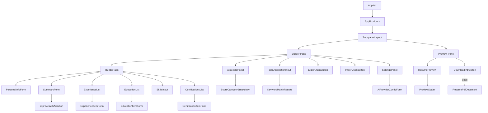
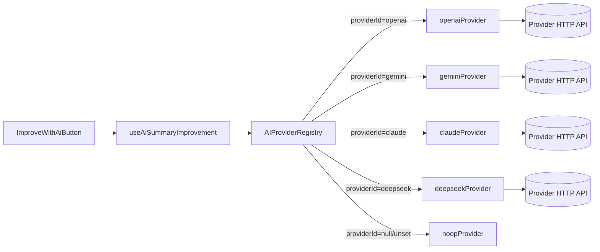
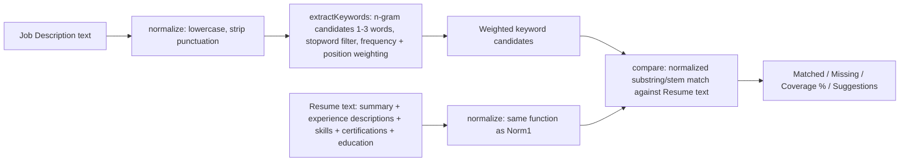
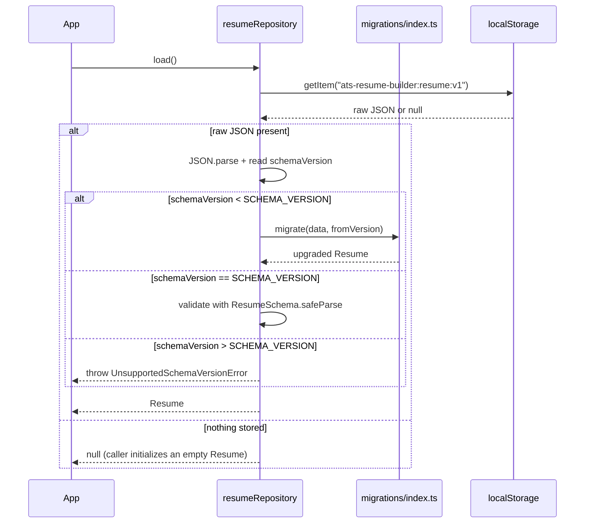

# ATS Resume Builder — Architecture Document

Version: 1.0.0
Companion to: `prd.md`, `tasks.md`

This document is the technical source of truth. It is written so that an implementation agent can build the system without further clarification. Where a decision has tradeoffs, the tradeoff is stated explicitly.

---

## 1. Tech Stack Summary & Rationale

| Layer | Choice | Why |
|---|---|---|
| UI Framework | React 18 + TypeScript (strict) | Required. Mature ecosystem, works great with shadcn/ui and RHF. |
| Build tool | Vite | Fast dev server/HMR, minimal config, tree-shakeable production build, no backend needed. |
| Styling | Tailwind CSS | Utility-first, keeps the ATS template's print CSS and the app UI cleanly separated, no runtime CSS-in-JS cost. |
| Components | shadcn/ui | Copy-in components (not an npm black box) — we own and can strip down the code, important for keeping the PDF/print path free of library-specific DOM quirks. |
| Forms | React Hook Form | Uncontrolled-by-default forms scale to large dynamic field arrays (Experience/Education/Certifications) without re-render storms — critical for "live preview updates instantly while typing" with many fields on screen at once. |
| Validation | Zod | Single schema is the source of truth for both runtime validation (forms, import) and static TypeScript types (`z.infer`). Removes type/validation drift. |
| State Management | **Zustand** (see §4 for full justification) | Chosen over React Context. |
| Storage | `localStorage`, wrapped in a typed Storage Service | Required by spec; wrapped so it's swappable later (e.g., IndexedDB) without touching feature code. |
| PDF | **`@react-pdf/renderer`** (see §12 for full justification) | Produces real, selectable text nodes in the PDF (not a canvas screenshot), which is a hard ATS-compatibility requirement. |
| AI | Adapter pattern, providers implement a common `AIProvider` interface | Required by spec: swappable, no hardcoded provider, MVP works fully without it. |

---

## 2. Folder Structure

Feature-first (a.k.a. "package by feature"), with a small shared kernel. Each feature owns its components, hooks, and feature-local logic; cross-cutting domain logic (scoring, keyword extraction) lives in `engines/` since it's consumed by more than one feature (builder + preview both read the score).

```
src/
├── app/
│   ├── App.tsx                     # Root layout: builder + preview panes, routing (if any)
│   ├── providers/
│   │   └── AppProviders.tsx        # Wraps app with theme provider, toast provider, etc.
│   └── router.tsx                  # If multi-view (Builder / Settings) — simple client routing
│
├── features/
│   ├── resume-builder/
│   │   ├── components/
│   │   │   ├── PersonalInfoForm.tsx
│   │   │   ├── SummaryForm.tsx
│   │   │   ├── ExperienceList.tsx
│   │   │   ├── ExperienceItemForm.tsx
│   │   │   ├── EducationList.tsx
│   │   │   ├── EducationItemForm.tsx
│   │   │   ├── SkillsInput.tsx
│   │   │   ├── CertificationsList.tsx
│   │   │   ├── CertificationItemForm.tsx
│   │   │   └── BuilderTabs.tsx     # Section navigation (Personal / Summary / Experience / ...)
│   │   ├── hooks/
│   │   │   ├── useResumeForm.ts    # RHF setup bound to the resume schema
│   │   │   └── useFieldArrayHelpers.ts
│   │   └── schema/
│   │       └── formSchemas.ts      # Zod sub-schemas per form section (re-exported from domain schema)
│   │
│   ├── resume-preview/
│   │   ├── components/
│   │   │   ├── ResumePreview.tsx   # Renders the SAME template markup used by PDF (see §7)
│   │   │   └── PreviewScaler.tsx   # Handles zoom/fit-to-width for the preview pane
│   │   └── hooks/
│   │       └── usePreviewSync.ts
│   │
│   ├── pdf-export/
│   │   ├── components/
│   │   │   └── DownloadPdfButton.tsx
│   │   └── document/
│   │       └── ResumePdfDocument.tsx  # @react-pdf/renderer <Document> tree, shares template logic w/ preview
│   │
│   ├── ats-score/
│   │   ├── components/
│   │   │   ├── AtsScorePanel.tsx
│   │   │   └── ScoreCategoryBreakdown.tsx
│   │   └── hooks/
│   │       └── useAtsScore.ts      # Subscribes to resume store, calls engines/ats-engine (debounced)
│   │
│   ├── keyword-match/
│   │   ├── components/
│   │   │   ├── JobDescriptionInput.tsx
│   │   │   └── KeywordMatchResults.tsx
│   │   └── hooks/
│   │       └── useKeywordMatch.ts  # Calls engines/keyword-engine (debounced)
│   │
│   ├── ai-assist/
│   │   ├── components/
│   │   │   └── ImproveWithAiButton.tsx
│   │   └── hooks/
│   │       └── useAiSummaryImprovement.ts
│   │
│   ├── import-export/
│   │   ├── components/
│   │   │   ├── ExportJsonButton.tsx
│   │   │   └── ImportJsonButton.tsx
│   │   └── utils/
│   │       └── fileIo.ts           # Browser File/Blob helpers
│   │
│   └── settings/
│       ├── components/
│       │   ├── SettingsPanel.tsx
│       │   └── AiProviderConfigForm.tsx
│       └── hooks/
│           └── useSettingsForm.ts
│
├── engines/                        # Pure, deterministic domain logic — NO React, NO I/O
│   ├── ats-engine/
│   │   ├── index.ts                # calculateAtsScore(resume, jdMatch?): AtsScoreResult
│   │   ├── rules/
│   │   │   ├── contactInfoRule.ts
│   │   │   ├── summaryRule.ts
│   │   │   ├── experienceRule.ts
│   │   │   ├── educationRule.ts
│   │   │   ├── skillsRule.ts
│   │   │   ├── certificationsRule.ts
│   │   │   ├── completenessRule.ts
│   │   │   └── formattingRule.ts
│   │   └── weights.ts
│   └── keyword-engine/
│       ├── index.ts                # matchKeywords(resume, jobDescription): KeywordMatchResult
│       ├── extractKeywords.ts
│       ├── normalize.ts            # lowercase, strip punctuation, stem
│       └── stopwords.ts
│
├── services/                       # Infrastructure / side-effecting layer
│   ├── storage/
│   │   ├── StorageService.ts       # Typed wrapper over localStorage (get/set/remove, JSON safe)
│   │   ├── resumeRepository.ts     # save/load Resume via StorageService, debounced writes
│   │   ├── settingsRepository.ts   # save/load app Settings (incl. AI config) via StorageService
│   │   └── migrations/
│   │       ├── index.ts            # migrate(data, fromVersion): CurrentResumeShape
│   │       ├── v1.ts
│   │       └── ...
│   ├── ai/
│   │   ├── AIProvider.ts           # interface + shared types
│   │   ├── AIProviderRegistry.ts   # maps providerId -> factory
│   │   ├── providers/
│   │   │   ├── openaiProvider.ts
│   │   │   ├── geminiProvider.ts
│   │   │   ├── claudeProvider.ts
│   │   │   ├── deepseekProvider.ts
│   │   │   └── noopProvider.ts     # returned when no provider configured; always "unavailable"
│   │   └── prompts/
│   │       └── improveSummaryPrompt.ts
│   └── pdf/
│       └── generatePdfBlob.ts      # Wraps @react-pdf/renderer's pdf().toBlob()
│
├── store/
│   ├── resumeStore.ts              # Zustand store: resume data + actions
│   ├── settingsStore.ts            # Zustand store: AI provider config, UI prefs
│   ├── uiStore.ts                  # Zustand store: transient UI state (active tab, modals)
│   └── selectors/
│       └── resumeSelectors.ts      # Memoized derived-data selectors
│
├── types/
│   ├── resume.ts                   # Zod schema + z.infer types: Resume, Experience, Education, ...
│   ├── ats.ts                      # AtsScoreResult, CategoryScore, Suggestion
│   ├── keyword.ts                  # KeywordMatchResult
│   ├── ai.ts                       # AIProviderConfig, AIRequest, AIResponse
│   └── settings.ts                 # AppSettings
│
├── hooks/                          # Cross-feature reusable hooks
│   ├── useDebouncedValue.ts
│   ├── useDebouncedCallback.ts
│   └── useLocalStorageAvailability.ts
│
├── components/
│   └── ui/                         # shadcn/ui generated primitives (button, input, dialog, tabs, ...)
│
├── lib/
│   ├── cn.ts                       # className merge helper (shadcn convention)
│   └── slug.ts                     # filename slug helper (for PDF/JSON download names)
│
├── styles/
│   ├── globals.css                 # Tailwind base + app theme tokens
│   └── print.css                   # Print-specific overrides (not used by @react-pdf path, kept for
│                                    #   any future "print directly from browser" fallback)
│
├── App.tsx
└── main.tsx
```

**Rule of thumb enforced by this structure**: `engines/` and `types/` never import from `features/`, `components/`, or `store/`. Dependencies only flow inward: `features → store → engines/services → types`. This is what makes the ATS/Keyword engines independently unit-testable and, later, reusable outside the app (e.g., a CLI or a future backend).

---

## 3. Component Hierarchy



Key rule: `ResumePreview` (screen) and `ResumePdfDocument` (PDF) both render from **one shared "resume layout" description** (section order, which fields are shown, empty-section omission logic) — see §7 — to guarantee WYSIWYG (FR-3.2).

---

## 4. State Management: Zustand (chosen over React Context)

**Decision: Zustand.**

| Concern | React Context | Zustand |
|---|---|---|
| Re-render granularity | Any Provider value change re-renders **all** consumers unless manually split into many small contexts | Selector-based subscriptions — a component subscribing to `state.resume.personalInfo` does not re-render when `state.resume.experience` changes |
| Read/write outside React tree | Awkward (needs refs/hacks) | Trivial — `resumeStore.getState()` / `.setState()`, used by the debounced autosave service and by engines invoked from non-component code |
| Boilerplate for many independent slices (resume, settings, ui) | Needs multiple nested Providers or one large reducer with careful memoization | Multiple small, independent stores, no provider nesting |
| DevTools | Manual | Built-in middleware (`zustand/middleware/devtools`) |

Given this app has **many independent, frequently-updating fields** (personal info, summary, N experience entries, N education entries, skills, certifications) all feeding a live preview and a debounced autosave, Context's "everything re-renders" default would either hurt typing performance or force the team to hand-roll the exact kind of fine-grained subscription that Zustand provides out of the box. Combined with React Hook Form (which already avoids re-rendering the *form* on every keystroke), Zustand is used as the **source of truth that RHF syncs into** (see §5 Data Flow) so that preview, ATS score, and keyword match can each subscribe only to the slices they need.

**Tradeoff accepted**: Zustand is an extra dependency beyond "just React." Justified because Context's granularity problem is a real, direct threat to the PRD's "instant" live-preview requirement (FR-3.1) once the form grows to realistic size (10+ experience/education rows).

### Store slices

- `resumeStore` — the `Resume` domain object + actions (`updatePersonalInfo`, `addExperience`, `updateExperience`, `removeExperience`, `reorderExperience`, ... one action family per section). This is the single source of truth persisted to storage.
- `settingsStore` — `AppSettings` (selected AI provider id + per-provider config, e.g., API key — see §11 for how keys are stored/redacted). Persisted separately from resume data (different storage key, different lifecycle).
- `uiStore` — transient, never persisted: active builder tab, dialog open/close state, "Saving…" indicator state, AI suggestion preview state (pending suggestion text before Accept/Discard).

---

## 5. Data Flow

```mermaid
sequenceDiagram
    participant User
    participant RHF as React Hook Form
    participant Store as resumeStore (Zustand)
    participant Preview as ResumePreview
    participant Engines as ATS / Keyword Engines
    participant Storage as StorageService (localStorage)

    User->>RHF: types in a field
    RHF->>Store: onChange -> store.updateX(value) (per-field, not full form submit)
    Store-->>Preview: selector notifies subscribed components
    Preview->>Preview: re-render instantly (no debounce)
    Store-->>Engines: useAtsScore/useKeywordMatch hooks read store via debounced selector
    Engines-->>Store: (read-only; engines are pure functions, do not write back)
    Store-->>Storage: debounced (500ms) autosave subscriber writes JSON to localStorage
    Storage-->>Store: on app load, resumeRepository.load() hydrates store's initial state
```

**Why RHF writes into Zustand instead of RHF state being the source of truth**: the Preview, ATS engine, and Keyword engine all need to read resume data outside the form tree. Rather than lifting all of RHF's internal state or prop-drilling, each form section's `onChange`/`onBlur` pushes committed values into `resumeStore`. RHF still owns transient validation state (touched/error/dirty) locally per field — that state does NOT need to live in the global store, since only the form UI itself needs it.

**Debounce boundaries** (explicit, because the PRD requires "instant" preview but debounced heavier work):
- Preview render: **no debounce** (subscribes directly to store).
- `localStorage` write: **debounced 500ms** (`resumeRepository`).
- ATS score recompute: **debounced ~300ms**.
- Keyword match recompute: **debounced ~300ms**, and only runs when a Job Description is present.
- PDF generation: **not debounced** — it's an explicit user action (button click), not a reactive computation.

---

## 6. Type Definitions (Domain Model)

All types are derived from Zod schemas in `types/resume.ts` via `z.infer`, so validation and typing can never drift apart.

```ts
// types/resume.ts (illustrative — implementation agent should write the actual Zod schemas)

export const SCHEMA_VERSION = 1;

// PersonalInfo
FullName: string (required, min 1)
JobTitle: string (optional)
Email: string (optional, must be valid email if present)
Phone: string (optional)
City: string (optional)
LinkedIn: string (optional, must be valid URL if present)
Portfolio: string (optional, must be valid URL if present)

// Experience (array item)
id: string (uuid, client-generated)
company: string (required)
position: string (required)
location: string (optional)
startDate: string (ISO "YYYY-MM" format)
endDate: string | null (ISO "YYYY-MM", null when isCurrent = true)
isCurrent: boolean
description: string (optional, multi-line; rendered as bullet points split by newline)

// Education (array item)
id: string (uuid)
institution: string (required)
degree: string (required)
fieldOfStudy: string (optional)
startDate: string (ISO "YYYY-MM")
endDate: string | null
isCurrent: boolean
description: string (optional)

// Certification (array item)
id: string (uuid)
name: string (required)
issuer: string (optional)
date: string (ISO "YYYY-MM", optional)
credentialUrl: string (optional, valid URL if present)

// Skills
skills: string[] (deduplicated case-insensitively, trimmed, non-empty)

// Resume (root)
schemaVersion: number
personalInfo: PersonalInfo
summary: string (optional)
experience: Experience[]
education: Education[]
skills: string[]
certifications: Certification[]
meta: {
  updatedAt: string (ISO datetime, set on every save)
}
```

Other core types:

- `types/ats.ts`: `AtsScoreResult { overall: number; categories: CategoryScore[] }`, `CategoryScore { key: AtsCategoryKey; label: string; score: number; maxScore: number; suggestions: string[] }`.
- `types/keyword.ts`: `KeywordMatchResult { matched: KeywordHit[]; missing: KeywordHit[]; coveragePercent: number; suggestions: string[] }`, `KeywordHit { term: string; weight: number }`.
- `types/ai.ts`: `AIProviderId = 'openai' | 'gemini' | 'claude' | 'deepseek'`, `AIProviderConfig { providerId: AIProviderId | null; apiKey?: string; model?: string }`, `AIImproveSummaryRequest { currentSummary: string; jobTitle?: string; topSkills?: string[] }`, `AIImproveSummaryResponse { suggestion: string }`.
- `types/settings.ts`: `AppSettings { ai: AIProviderConfig }`.

---

## 7. Shared Template Layer (WYSIWYG guarantee)

To satisfy FR-3.2 (preview and PDF must match exactly), section-visibility and ordering logic is centralized and consumed by *both* renderers:

```
engines/ (or a small shared "template" module, e.g. features/resume-preview/templateModel.ts)
  buildResumeSections(resume: Resume): ResumeSection[]
```

`ResumeSection` is a renderer-agnostic description (`{ key, title, visible, items }`) — e.g., it decides "Certifications section is hidden because `certifications.length === 0`" **once**. `ResumePreview.tsx` maps this to HTML/Tailwind; `ResumePdfDocument.tsx` maps the *same* array to `@react-pdf/renderer` primitives (`<View>`, `<Text>`). Section ordering, heading text, and visibility rules must never be duplicated/hand-written twice — that duplication is exactly how preview/PDF drift happens.

---

## 8. Utility Layer

- `lib/cn.ts` — Tailwind class merge (clsx + tailwind-merge), shadcn/ui convention.
- `lib/slug.ts` — turns "Budi Santoso" into `budi-santoso-resume` for download filenames.
- `engines/keyword-engine/normalize.ts` — lowercasing, punctuation stripping, light stemming (suffix rules; no external NLP dependency needed for MVP) shared by both keyword extraction and resume-text comparison so both sides normalize identically.
- Date formatting helper (e.g., `formatMonthYear(iso: string): string` → "Jan 2023") used identically by preview and PDF.

---

## 9. Hooks

- `useDebouncedValue<T>(value: T, delayMs: number): T` — generic, used by ATS/keyword hooks.
- `useDebouncedCallback(fn, delayMs)` — used by the autosave subscriber.
- `useLocalStorageAvailability()` — feature-detects `localStorage` at startup (try/catch a test write), exposes a boolean the app uses to show the "storage unavailable" warning (Edge Case in PRD §9).
- `useAtsScore()` (in `features/ats-score/hooks`) — subscribes to `resumeStore` (debounced), calls `engines/ats-engine`, returns `AtsScoreResult`.
- `useKeywordMatch(jobDescription: string)` — subscribes to `resumeStore` + local JD text (debounced), calls `engines/keyword-engine`.
- `useAiSummaryImprovement()` — orchestrates calling `AIProviderRegistry.getActiveProvider()`, manages loading/error/suggestion state (lives in `uiStore` or local component state — transient, not persisted).

---

## 10. Services

- **StorageService** (`services/storage/StorageService.ts`): thin, typed wrapper — `get<T>(key): T | null`, `set<T>(key, value): boolean`, `remove(key): void`. Centralizes `try/catch` around `JSON.parse`/`localStorage` quota errors so every call site doesn't repeat that logic.
- **resumeRepository**: `load(): Resume | null` (runs migration if needed), `save(resume: Resume): void` (debounced wrapper lives in the store subscriber, not here — this function itself is a plain synchronous write).
- **settingsRepository**: same shape as `resumeRepository`, separate storage key (`ats-resume-builder:settings:v1`), so clearing/exporting resume data never touches AI credentials and vice versa.
- **AI services** (`services/ai/*`): see §11.
- **PDF service** (`services/pdf/generatePdfBlob.ts`): wraps `pdf(<ResumePdfDocument resume={resume} />).toBlob()`, exposes a single `downloadResumePdf(resume: Resume): Promise<void>` that also triggers the browser download via an `<a>`/Blob URL, using `lib/slug.ts` for the filename.

---

## 11. AI Provider Layer

### 11.1 Interface (the core extensibility point)

```ts
// services/ai/AIProvider.ts
interface AIProvider {
  readonly id: AIProviderId;
  readonly label: string;
  isConfigured(config: AIProviderConfig): boolean;
  improveSummary(
    request: AIImproveSummaryRequest,
    config: AIProviderConfig
  ): Promise<AIImproveSummaryResponse>;
}
```

Every provider (`openaiProvider`, `geminiProvider`, `claudeProvider`, `deepseekProvider`) implements this interface, encapsulating its own request/response shape and endpoint internally. A `noopProvider` implements the same interface and is returned by the registry when no provider is configured — it makes `isConfigured()` return `false` and `improveSummary()` reject with a typed `AIProviderNotConfiguredError`. This means calling code (`useAiSummaryImprovement`) never needs `if (provider) {...} else {...}` branching sprinkled around the app — it always has *a* provider object, and the UI simply disables the button when `isConfigured()` is false.

### 11.2 Registry

```ts
// services/ai/AIProviderRegistry.ts
class AIProviderRegistry {
  static getProvider(id: AIProviderId | null): AIProvider   // returns noopProvider if id is null/unknown
  static getAllProviders(): AIProvider[]                     // for the Settings provider dropdown
}
```

`SettingsPanel` reads `getAllProviders()` to render the dropdown (label + id) without knowing implementation details. `useAiSummaryImprovement` reads `settingsStore.ai.providerId`, resolves it via `getProvider()`, and calls `.improveSummary(...)`.



### 11.3 Credential storage & disclosure

- API keys are stored via `settingsRepository` in `localStorage`, scoped separately from resume data.
- Because there is no backend, calls are made **directly from the browser** to the provider's API. This is disclosed to the user in the Settings UI (see PRD §12 Risks) — this is a conscious, documented tradeoff of the "no backend" constraint, not an oversight.
- Keys are never logged, never included in resume JSON export, and never sent anywhere except the configured provider's official API endpoint.
- `improveSummary` requests send only `currentSummary` (+ optionally `jobTitle`/`topSkills` if the user's chosen provider config opts in) — never the full resume — minimizing data exposure (FR-9.3).

### 11.4 Prompt

`prompts/improveSummaryPrompt.ts` exports a single `buildImproveSummaryPrompt(request)` function used by all providers so prompt wording stays consistent regardless of which provider is active; only the transport/response-parsing differs per provider file.

### 11.5 Graceful degradation

- MVP ships with zero providers "active" by default (`settingsStore.ai.providerId = null`).
- Every AI-adjacent UI element must check `provider.isConfigured(config)` and render a disabled state + short explanation rather than hiding itself entirely (so users discover the feature exists).
- Errors from `improveSummary` (network failure, non-2xx, malformed response) are caught in `useAiSummaryImprovement`, mapped to a small set of user-facing error categories (`network`, `auth`, `rateLimit`, `unknown`), and never thrown uncaught into the component tree (see §16 Error Handling).

---

## 12. PDF Layer

**Decision: `@react-pdf/renderer`.**

| Option | Selectable text? | Pagination control | Notes |
|---|---|---|---|
| `window.print()` + print CSS | Yes (browser native) | Poor — browser print pagination is inconsistent across OS/browser print dialogs, hard to guarantee "no content cut across page boundary" (FR-4.2) | Kept only as a documented *fallback idea* in `styles/print.css`, not the primary path |
| `html2canvas` + `jsPDF` | **No** — produces a rasterized image of the DOM embedded in the PDF | Manual, error-prone | **Rejected**: fails the hard ATS requirement that PDF text be real, parseable text (FR-4.3). This is disqualifying, not just suboptimal. |
| `@react-pdf/renderer` | **Yes** — builds the PDF from `<Text>`/`<View>` primitives with real text objects | Built-in automatic pagination (`wrap`, `break` props), designed exactly for this "flow content across pages" use case | **Chosen.** |

`@react-pdf/renderer`'s document tree (`ResumePdfDocument.tsx`) is built from the same `buildResumeSections(resume)` output described in §7, so the PDF cannot drift from the on-screen preview. Font choice must be a standard, embeddable, ATS-safe font (e.g., Helvetica/Arial-equivalent or a bundled open-license sans-serif like Inter) — no icon fonts, no custom decorative fonts.

`generatePdfBlob.ts` uses `pdf(doc).toBlob()` (client-side, no server rendering needed) and triggers download via a Blob URL — consistent with the "no backend" constraint.

---

## 13. ATS Engine

Location: `engines/ats-engine/`. Pure functions, no I/O, unit-testable in isolation with plain `Resume` fixtures.

### 13.1 Algorithm shape

```ts
function calculateAtsScore(resume: Resume, keywordMatch?: KeywordMatchResult): AtsScoreResult
```

Each category is computed by its own rule module (`rules/*.ts`) returning `{ score, maxScore, suggestions }`; `index.ts` sums them into `overall` (0–100, normalized).

### 13.2 Default category weights (out of 100)

| Category | Weight | Example deterministic checks |
|---|---|---|
| Contact Information | 15 | Full name present (required, else large penalty); email present & valid; phone present; city present |
| Summary | 10 | Present; word count within a healthy range (e.g., 25–60 words) — too short or missing loses points, excessively long loses a smaller amount |
| Experience | 20 | At least 1 entry; each entry has company+position+dates; descriptions present and each has enough content (e.g., ≥1 bullet / ≥40 chars) |
| Education | 10 | At least 1 entry; institution+degree present |
| Skills | 10 | At least 3 skills present; not excessively few |
| Certifications | 5 | Optional category — present entries score bonus-style but absence is not heavily penalized (not everyone has certifications) |
| Keyword Match | 15 | Only scored when a Job Description has been provided (`keywordMatch` present); uses `coveragePercent` directly. **When no JD is provided, this weight is redistributed proportionally across the other categories** so the max possible score is still 100 without requiring a JD. |
| Resume Completeness | 10 | Aggregate: proportion of all optional-but-recommended fields filled (LinkedIn, City, at least one Certification, etc.) |
| Formatting Rules | 5 | Structural checks inherent to using the single ATS template (e.g., summary not empty causing an orphan heading, no field containing raw HTML/script-like content, dates parse correctly) — mostly a safety net since the template itself enforces ATS-safe formatting by construction |

Weights live in `weights.ts` as a single exported constant object so they can be tuned without touching rule logic.

### 13.3 Determinism requirement

No rule may depend on `Date.now()`, randomness, or network/AI calls. The same `Resume` object must always produce the same `AtsScoreResult`. This is a hard constraint from the PRD (FR-7.1) and is what makes the engine trivially unit-testable with fixed fixtures.

### 13.4 Suggestions

Every rule that loses points must push at least one specific, actionable string into its `suggestions` array (e.g., `"Add a phone number so recruiters and ATS parsers can find your contact info."`) rather than a generic "improve this section" — this directly satisfies PRD FR-7.3.

---

## 14. Keyword Engine

Location: `engines/keyword-engine/`. Also pure/deterministic (PRD explicitly requires "no AI required").

### 14.1 Pipeline



- `extractKeywords`: tokenizes the JD, removes stopwords (`stopwords.ts`), builds 1–3 word n-gram candidates, scores candidates by frequency and by whether they appear in JD sections that look like requirements (heuristic: lines near words like "requirements", "qualifications", "must have" get a small weight boost — still fully deterministic, no AI).
- `normalize.ts` is shared by both the JD side and the resume side so comparison is apples-to-apples (same casing/stemming rules).
- Coverage % = weighted sum of matched candidate weights ÷ weighted sum of all candidate weights, expressed as a percentage — not a naive unweighted count, so a keyword appearing many times / in a "requirements" section counts more (this is documented so the number is explainable to the user, satisfying the "deterministic and understandable" spirit of PRD FR-8).
- Suggestions: for each high-weight missing keyword, produce `"Consider adding '<term>' to your Skills or Experience if it genuinely applies to you."` — the "if it genuinely applies" phrasing is intentional; the app must never encourage fabricating experience.

---

## 15. Validation Layer

- Single Zod schema per domain entity in `types/resume.ts`; form-level schemas in `features/resume-builder/schema/formSchemas.ts` re-export/compose from it (never redefine field rules twice).
- React Hook Form uses `@hookform/resolvers/zod` to bind Zod schemas directly, giving inline field errors without extra glue code.
- Import validation (`FR-6.2`) reuses the exact same root `ResumeSchema.safeParse()` — the single schema is shared by forms and file-import, so there is exactly one definition of "what a valid Resume looks like" in the whole codebase.

---

## 16. Storage Layer & Versioning



- Storage keys are namespaced and versioned in the key itself (`ats-resume-builder:resume:v1`) as a belt-and-suspenders measure alongside the in-payload `schemaVersion` field — this means even a hypothetical future *breaking* key-format change can coexist during a transition without clobbering old data.
- `migrations/index.ts` holds an ordered chain (`v1 -> v2 -> v3...`); each migration file is a pure function `(old: unknown) => NewShape`. Adding a future field to the Resume model means: bump `SCHEMA_VERSION`, add a `vN.ts` migration, add it to the chain — existing users' `localStorage` data upgrades transparently on next load.
- Import (`FR-6.3`) runs through the exact same `migrate()` function as normal load, so "loading old localStorage data" and "importing an old JSON export" are the same code path.

---

## 17. AI Provider Layer — see §11 (kept together with PDF/ATS/Keyword ordering above for readability; cross-referenced here since the requirements list calls it out separately).

---

## 18. Theme Architecture

- Tailwind CSS with a small set of CSS custom properties (design tokens) defined in `styles/globals.css` (e.g., `--background`, `--foreground`, `--primary`, `--muted`, `--border`), consumed by shadcn/ui's component variants — this is shadcn/ui's standard theming convention and keeps light/dark mode (if added later) to a single token swap rather than component-by-component edits.
- The **resume template itself** (preview + PDF) intentionally does **not** use the app's theme tokens — it has its own fixed, print-safe, high-contrast black-on-white style sheet (`resume-template` tokens, separate from app `theme` tokens), because the resume's visual style must stay constant and ATS-safe regardless of the app's own UI theme (e.g., even if the app ships a dark mode later, the resume preview/PDF stays light, since that's what gets printed/parsed).

---

## 19. Error Handling

Principles:
1. **No feature's failure can corrupt or lose already-saved resume data.** Storage writes are the most protected path — the repository never writes partial/invalid data (it validates before writing where feasible, and writes are additive/atomic via a single `setItem` call).
2. **AI and network errors are always caught at the service boundary** (`services/ai/providers/*`) and normalized into a small typed error union before reaching UI hooks — components never need to `try/catch` raw `fetch` errors themselves.
3. **A top-level React Error Boundary** wraps the app (or at least the Builder/Preview panes independently, so a rendering bug in, say, the PDF preview doesn't take down the whole form) and shows a recoverable "Something went wrong" state with an option to reload — this must never show a blank white screen.
4. **Validation errors are always inline and non-blocking** for form typing (never a blocking modal for a simple field-level issue); **import errors** are the one case that legitimately blocks (a confirmation/error dialog), since a bad import is a discrete, user-initiated, all-or-nothing action.
5. **`localStorage` failures are caught at the `StorageService` boundary** and surfaced once via a non-blocking toast/banner ("Your changes are not being saved automatically in this session") rather than repeated on every keystroke.

| Error source | Where caught | User-facing behavior |
|---|---|---|
| Form field invalid | RHF + Zod resolver | Inline field error text |
| Import JSON invalid/wrong shape | `ResumeSchema.safeParse` in import handler | Blocking confirmation dialog explaining the specific validation failure |
| Import JSON newer schemaVersion | `resumeRepository`/import handler | Blocking dialog: "This file was created with a newer version of the app" |
| `localStorage` quota/unavailable | `StorageService` | One-time non-blocking banner; app continues in-memory |
| AI provider network/auth/rate-limit error | `services/ai/providers/*` → `useAiSummaryImprovement` | Inline error near the "Improve with AI" button with a Retry action; original summary untouched |
| PDF generation failure (e.g., malformed data edge case) | `generatePdfBlob` try/catch | Toast: "Couldn't generate PDF, please try again"; resume data untouched |
| Unexpected render error anywhere in Builder/Preview | React Error Boundary | Recoverable fallback UI, "Reload" action; does not affect `localStorage`-persisted data |

---

## 20. Future Scalability

- **Storage layer swap**: because all persistence goes through `StorageService`/`resumeRepository`/`settingsRepository`, migrating from `localStorage` to `IndexedDB` (e.g., for multi-resume support in the Roadmap) touches only `services/storage/`, not features.
- **Multi-resume support**: the current single-resume-per-browser model can extend to a list of `{ id, name, resume }` records behind the same repository interface without changing `engines/` or most `features/`.
- **New AI providers**: adding a provider is "implement `AIProvider`, register it in `AIProviderRegistry`" — zero changes needed in `features/ai-assist` or anywhere else that calls the interface.
- **New ATS rules or reweighting**: adding a rule means adding one file to `engines/ats-engine/rules/` and wiring it into `index.ts` + `weights.ts`; no UI changes required since `AtsScorePanel` renders whatever categories come back generically.
- **Backend introduction later** (e.g., if the product ever adds optional cloud sync): because domain logic (`engines/`) has zero dependency on `services/storage` or React, it could be lifted into a server context (e.g., to run ATS scoring server-side for a future recruiter-facing product) with no rewrite.
- **New templates**: because `buildResumeSections()` (§7) already separates "what to render" from "how to render it," adding Template #2 later means adding a second renderer pair (preview+PDF) that consumes the same section model, not rebuilding data logic.

---

## 21. Design Decisions & Tradeoffs (summary table)

| Decision | Alternative considered | Why chosen | Tradeoff accepted |
|---|---|---|---|
| Zustand for state | React Context | Fine-grained subscriptions needed for instant live preview at realistic resume sizes | One extra dependency |
| `@react-pdf/renderer` for PDF | `html2canvas` + `jsPDF`; `window.print()` | Only option guaranteeing real selectable text + reliable pagination, both hard ATS requirements | Resume preview and PDF are two separate render targets that must be kept in sync via the shared section-model layer (§7) — extra discipline required, mitigated architecturally rather than left to convention |
| Single ATS template only | Multiple templates | PRD scope constraint; keeps ATS-safety guarantees simple to verify | Less visual variety for users (documented in Roadmap as future work) |
| AI adapter/interface pattern | Directly calling one hardcoded provider's SDK | PRD hard requirement: swappable providers, graceful "no AI" mode | Slightly more indirection/boilerplate (one interface + one file per provider) than calling an SDK directly |
| Deterministic ATS/Keyword engines with zero AI dependency | Using an LLM to "guess" a score | PRD hard requirement: score/match must work with zero AI configured, and be explainable/reproducible | Heuristic scoring is necessarily an approximation of real-world ATS behavior (disclosed to user, see PRD Risks) |
| `localStorage` only (no IndexedDB) for MVP | IndexedDB from day one | Spec constraint; resume data is small (KBs), `localStorage`'s simplicity/sync API is sufficient and easier to reason about for MVP | Ceiling on storage size and no structured querying — acceptable given single-resume MVP scope; storage layer is abstracted so this is changeable later (§20) |
| Feature-first folders + a shared `engines/` kernel | Strict "feature folder owns everything, no shared logic" | ATS score and Keyword match are consumed by more than one feature (builder inline hints + dedicated panels); centralizing avoids duplicated scoring logic | Slightly more indirection when a new engineer looks for "where is the scoring logic" — mitigated by this document and consistent naming |
| Last-write-wins across multiple tabs | Cross-tab sync (BroadcastChannel/storage events) | Out of MVP scope per PRD; added complexity not justified for a single-user local tool | Rare data-loss edge case if a user deliberately edits the same resume in two tabs simultaneously — acceptable, documented in PRD Edge Cases |
