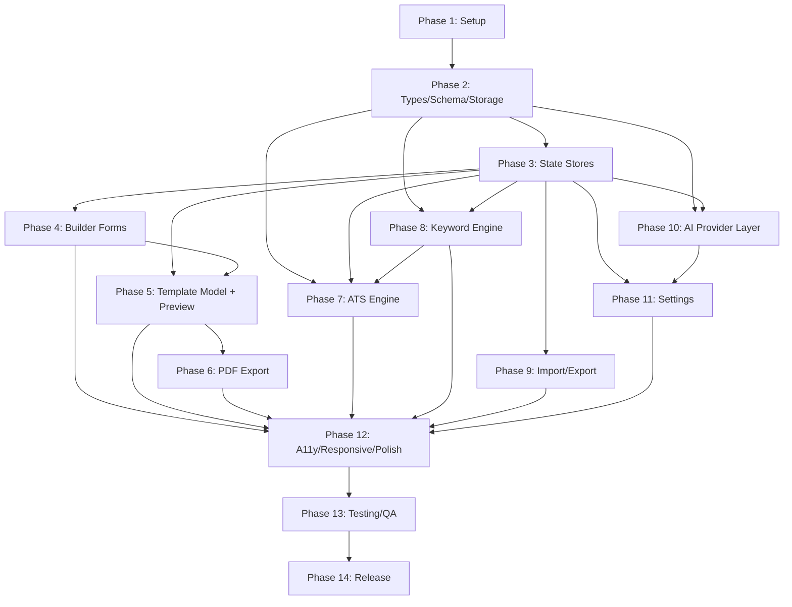

# ATS Resume Builder — Implementation Tasks

Version: 1.0.0
Companion to: `prd.md`, `architecture.md`

Legend:
- **Priority**: P0 (blocking/critical path) · P1 (core MVP) · P2 (important, not blocking) · P3 (nice-to-have/polish)
- **Complexity**: XS (<1h) · S (~half day) · M (~1 day) · L (2-3 days) · XL (>3 days, should be split further during implementation)

Tasks are ordered so each phase unblocks the next, but within a phase, tasks without a listed dependency on each other can be done in parallel/any order.

---

## Phase 1 — Project Setup & Foundation

### 1.1 Initialize Vite + React + TypeScript project
- Priority: P0 · Complexity: S · Dependencies: none
- Acceptance Criteria: `npm run dev` starts a working React+TS app; strict mode enabled in `tsconfig.json`; no template boilerplate content left in `App.tsx`.

### 1.2 Install and configure Tailwind CSS
- Priority: P0 · Complexity: XS · Dependencies: 1.1
- Acceptance Criteria: Tailwind classes work in a test component; `styles/globals.css` includes Tailwind directives and base design tokens (CSS custom properties per Architecture §18).

### 1.3 Install and configure shadcn/ui
- Priority: P0 · Complexity: S · Dependencies: 1.2
- Acceptance Criteria: `components/ui/` populated with at least Button, Input, Textarea, Tabs, Dialog, Tooltip, Toast/Sonner, Select, Checkbox primitives; theme tokens wired per shadcn convention.

### 1.4 Configure ESLint + Prettier + strict TS rules
- Priority: P1 · Complexity: S · Dependencies: 1.1
- Acceptance Criteria: `no-explicit-any` and `strict` TS checks enabled; lint script passes on the initial scaffold; format-on-save config documented in README.

### 1.5 Set up folder structure skeleton
- Priority: P0 · Complexity: XS · Dependencies: 1.1
- Acceptance Criteria: All top-level folders from Architecture §2 exist (`features/`, `engines/`, `services/`, `store/`, `types/`, `hooks/`, `components/ui/`, `lib/`, `styles/`) with placeholder `index.ts`/`.gitkeep` where empty.

### 1.6 Install core dependencies
- Priority: P0 · Complexity: XS · Dependencies: 1.1
- Acceptance Criteria: `zustand`, `react-hook-form`, `zod`, `@hookform/resolvers`, `@react-pdf/renderer`, `uuid` (or `crypto.randomUUID` usage confirmed available) installed and importable without build errors.

### 1.7 Set up testing framework
- Priority: P1 · Complexity: S · Dependencies: 1.1
- Acceptance Criteria: Vitest (or equivalent) configured and runnable via `npm test`; one trivial passing test committed to prove the pipeline works.

### 1.8 Base app shell layout (two-pane Builder/Preview)
- Priority: P1 · Complexity: M · Dependencies: 1.3, 1.5
- Acceptance Criteria: `App.tsx` renders a responsive two-pane layout (builder left, preview right on desktop; stacked on mobile per PRD §7 Responsiveness), currently with placeholder content in each pane.

---

## Phase 2 — Domain Types, Schema & Storage Foundation

### 2.1 Define Resume Zod schema & inferred types
- Priority: P0 · Complexity: M · Dependencies: 1.6
- Acceptance Criteria: `types/resume.ts` implements the full model from Architecture §6 (PersonalInfo, Experience, Education, Certification, Resume root incl. `schemaVersion` and `meta.updatedAt`); `ResumeSchema.safeParse` correctly accepts a valid fixture and rejects an invalid one (covered by a unit test).

### 2.2 Define ATS, Keyword, AI, Settings types
- Priority: P0 · Complexity: S · Dependencies: 2.1
- Acceptance Criteria: `types/ats.ts`, `types/keyword.ts`, `types/ai.ts`, `types/settings.ts` implemented exactly per Architecture §6; all exported and imported cleanly with no circular dependencies.

### 2.3 Implement StorageService
- Priority: P0 · Complexity: S · Dependencies: 1.6
- Acceptance Criteria: `get/set/remove` wrap `localStorage` with try/catch; unit tests cover: normal read/write, quota-exceeded simulation, malformed JSON on read (returns `null` rather than throwing).

### 2.4 Implement resumeRepository (load/save, no migration yet)
- Priority: P0 · Complexity: S · Dependencies: 2.1, 2.3
- Acceptance Criteria: `load()` returns `null` when nothing stored, or a validated `Resume` when present; `save(resume)` persists under the namespaced/versioned key from Architecture §16.

### 2.5 Implement settingsRepository
- Priority: P1 · Complexity: XS · Dependencies: 2.2, 2.3
- Acceptance Criteria: Loads/saves `AppSettings` under its own separate storage key; unit test confirms resume and settings keys never collide.

### 2.6 Implement migration framework (schemaVersion chain)
- Priority: P1 · Complexity: M · Dependencies: 2.4
- Acceptance Criteria: `migrations/index.ts` runs a no-op chain correctly for `schemaVersion === SCHEMA_VERSION`; throws a typed `UnsupportedSchemaVersionError` for a future/unknown version; structure supports adding a `v2.ts` later without touching call sites (verified with a synthetic migration test in Phase 2 QA).

### 2.7 useLocalStorageAvailability hook
- Priority: P2 · Complexity: XS · Dependencies: 2.3
- Acceptance Criteria: Returns `false` when `localStorage` writes throw (simulated in test), `true` otherwise.

---

## Phase 3 — State Management (Zustand Stores)

### 3.1 Implement resumeStore
- Priority: P0 · Complexity: M · Dependencies: 2.1, 2.4
- Acceptance Criteria: Store initializes from `resumeRepository.load()` (or an empty default Resume); exposes actions for every section (`updatePersonalInfo`, `updateSummary`, `addExperience/updateExperience/removeExperience/reorderExperience`, equivalent for Education and Certifications, `addSkill/removeSkill` with case-insensitive de-dup per FR edge case); unit tests cover each action mutating state correctly.

### 3.2 Implement settingsStore
- Priority: P1 · Complexity: S · Dependencies: 2.5
- Acceptance Criteria: Store initializes from `settingsRepository.load()` (or defaults with `ai.providerId: null`); exposes `setAiProvider(id, config)`, `clearAiConfig()`.

### 3.3 Implement uiStore
- Priority: P1 · Complexity: XS · Dependencies: none (can run parallel to 3.1/3.2)
- Acceptance Criteria: Holds active builder tab, dialog open states, "Saving…" indicator state, AI suggestion preview transient state; nothing here is persisted.

### 3.4 Wire debounced autosave subscriber
- Priority: P0 · Complexity: M · Dependencies: 3.1, 2.4
- Acceptance Criteria: Any `resumeStore` mutation triggers a 500ms-debounced `resumeRepository.save()`; `uiStore`'s Saving/Saved indicator reflects debounce state; verified with a test using fake timers that rapid successive updates produce exactly one save call after the debounce window.

---

## Phase 4 — Resume Builder Forms

### 4.1 Form sub-schemas (RHF + Zod resolver wiring)
- Priority: P0 · Complexity: S · Dependencies: 2.1
- Acceptance Criteria: `formSchemas.ts` composes from `ResumeSchema` (no rule duplication per Architecture §15); `@hookform/resolvers/zod` wired in a shared `useResumeForm` pattern.

### 4.2 PersonalInfoForm component
- Priority: P0 · Complexity: M · Dependencies: 4.1, 3.1
- Acceptance Criteria: All 7 fields from PRD §6 FR-1.1 render, validate inline (invalid email/URL shows inline error without blocking typing), and each committed change updates `resumeStore` (verified manually + one integration test).

### 4.3 SummaryForm component
- Priority: P0 · Complexity: S · Dependencies: 4.1, 3.1
- Acceptance Criteria: Multi-line textarea updates `resumeStore.summary`; character/word count hint shown (supports ATS scoring guidance later).

### 4.4 ExperienceList + ExperienceItemForm (dynamic list)
- Priority: P0 · Complexity: L · Dependencies: 4.1, 3.1
- Acceptance Criteria: Add/remove/reorder works per FR-1.3/1.8; "Current Job" checkbox disables/clears End Date per FR-1.4; each field validated (Start ≤ End per FR-2.4); reorder persists to store and survives reload.

### 4.5 EducationList + EducationItemForm (dynamic list)
- Priority: P0 · Complexity: M · Dependencies: 4.1, 3.1
- Acceptance Criteria: Same dynamic-list guarantees as 4.4, applied to Education fields per Architecture §6.

### 4.6 SkillsInput (tag input)
- Priority: P0 · Complexity: M · Dependencies: 3.1
- Acceptance Criteria: Add via Enter/comma, remove via click or backspace-on-empty; case-insensitive de-dup enforced (PRD Edge Case); keyboard operable end-to-end (Accessibility NFR).

### 4.7 CertificationsList + CertificationItemForm (dynamic list)
- Priority: P1 · Complexity: M · Dependencies: 4.1, 3.1
- Acceptance Criteria: Same dynamic-list guarantees as 4.4/4.5, Credential URL validated as URL when present.

### 4.8 BuilderTabs section navigation
- Priority: P1 · Complexity: S · Dependencies: 4.2–4.7
- Acceptance Criteria: Tabs for Personal / Summary / Experience / Education / Skills / Certifications; active tab state in `uiStore`; fully keyboard navigable (arrow keys per ARIA tabs pattern).

---

## Phase 5 — Shared Template Model & Live Preview

### 5.1 Implement buildResumeSections()
- Priority: P0 · Complexity: M · Dependencies: 3.1
- Acceptance Criteria: Pure function per Architecture §7; empty-section omission logic covered by unit tests (e.g., zero certifications → Certifications section `visible: false`).

### 5.2 ResumePreview component (screen rendering)
- Priority: P0 · Complexity: L · Dependencies: 5.1
- Acceptance Criteria: Renders `buildResumeSections()` output as clean, single-column, ATS-safe HTML/Tailwind markup (no icons/tables/columns/graphics per PRD template requirements); updates with no perceptible debounce as store changes (FR-3.1).

### 5.3 PreviewScaler (zoom/fit-to-width)
- Priority: P2 · Complexity: S · Dependencies: 5.2
- Acceptance Criteria: Preview scales to fit its pane at various viewport widths without horizontal scroll/clipping on desktop and mobile.

### 5.4 Empty-state handling in preview
- Priority: P1 · Complexity: XS · Dependencies: 5.2
- Acceptance Criteria: A fully empty resume renders a helpful placeholder/prompt rather than a blank or broken layout (PRD Edge Case).

---

## Phase 6 — PDF Export

### 6.1 ResumePdfDocument (@react-pdf/renderer tree)
- Priority: P0 · Complexity: L · Dependencies: 5.1
- Acceptance Criteria: Consumes the same `buildResumeSections()` output as the screen preview; uses an ATS-safe embeddable font; produces real selectable text (verified by opening a generated PDF and confirming text is selectable/searchable, not an image).

### 6.2 Pagination correctness
- Priority: P0 · Complexity: M · Dependencies: 6.1
- Acceptance Criteria: A fixture resume long enough to span 2+ pages renders with no content cut mid-line and no overlapping text at page boundaries (FR-4.2) — verified visually against a generated test PDF and documented in a manual QA checklist.

### 6.3 generatePdfBlob service + download trigger
- Priority: P0 · Complexity: S · Dependencies: 6.1
- Acceptance Criteria: `downloadResumePdf(resume)` produces a Blob, triggers a browser download with filename from `lib/slug.ts` (FR-4.4 incl. empty-name fallback to `resume.pdf`).

### 6.4 DownloadPdfButton component + empty-resume guard
- Priority: P0 · Complexity: S · Dependencies: 6.3
- Acceptance Criteria: Button disabled/blocked with a friendly message when resume has no name filled (PRD Edge Case — the one export-blocking validation); loading state shown during generation; success/error toast shown.

---

## Phase 7 — ATS Score Engine & UI

### 7.1 Implement ats-engine rule modules
- Priority: P0 · Complexity: L · Dependencies: 2.1
- Acceptance Criteria: Each rule file (`contactInfoRule`, `summaryRule`, `experienceRule`, `educationRule`, `skillsRule`, `certificationsRule`, `completenessRule`, `formattingRule`) implemented per Architecture §13.2, each with unit tests covering a full-marks fixture and a zero-marks fixture.

### 7.2 Implement weights.ts and index.ts aggregation
- Priority: P0 · Complexity: M · Dependencies: 7.1
- Acceptance Criteria: `calculateAtsScore(resume, keywordMatch?)` sums weighted category scores into a 0–100 overall; keyword-match weight redistribution logic (when no JD provided) implemented and unit tested per Architecture §13.2; determinism verified by a test that calls the function twice on the same input and asserts identical output.

### 7.3 useAtsScore hook (debounced store subscription)
- Priority: P0 · Complexity: S · Dependencies: 7.2, 3.1
- Acceptance Criteria: Recomputes on resume change, debounced ~300ms (FR-7.4); returns loading/result state.

### 7.4 AtsScorePanel + ScoreCategoryBreakdown components
- Priority: P0 · Complexity: M · Dependencies: 7.3
- Acceptance Criteria: Displays overall score prominently, per-category breakdown with suggestions (FR-7.3); includes the ATS-parser-variance disclaimer from PRD §12 Risks; accessible (score changes announced via ARIA live region on significant change, not on every keystroke).

---

## Phase 8 — Keyword Match Engine & UI

### 8.1 Implement normalize.ts and stopwords.ts
- Priority: P0 · Complexity: S · Dependencies: none
- Acceptance Criteria: Shared normalization function used identically for JD and resume text; stopword list covers common English function words; unit tested.

### 8.2 Implement extractKeywords.ts
- Priority: P0 · Complexity: M · Dependencies: 8.1
- Acceptance Criteria: Produces weighted 1–3 word n-gram candidates from a JD fixture; requirements-section weighting heuristic implemented; unit tested against at least 2 realistic JD fixtures.

### 8.3 Implement matchKeywords (index.ts)
- Priority: P0 · Complexity: M · Dependencies: 8.2, 2.1
- Acceptance Criteria: Produces `KeywordMatchResult` with matched/missing/coveragePercent/suggestions per Architecture §14; handles the "0 extractable keywords" edge case without divide-by-zero (PRD Edge Case).

### 8.4 useKeywordMatch hook
- Priority: P0 · Complexity: S · Dependencies: 8.3
- Acceptance Criteria: Debounced ~300ms; only runs when JD text is non-empty; exposes result to both `KeywordMatchResults` and (via a store read) `useAtsScore`'s keyword category input.

### 8.5 JobDescriptionInput + KeywordMatchResults components
- Priority: P0 · Complexity: M · Dependencies: 8.4
- Acceptance Criteria: Textarea for JD paste; results panel shows Matched/Missing/Coverage %/Suggestions per FR-8.4; empty-keyword edge case shows a friendly message, not a broken UI.

### 8.6 Wire Keyword Match result into ATS Score
- Priority: P1 · Complexity: S · Dependencies: 8.4, 7.3
- Acceptance Criteria: When a JD is present, `AtsScorePanel`'s Keyword Match category reflects live `coveragePercent`; removing the JD reverts to weight-redistributed scoring without a full-page reload.

---

## Phase 9 — Import / Export

### 9.1 Implement fileIo.ts (Blob/File browser helpers)
- Priority: P1 · Complexity: S · Dependencies: none
- Acceptance Criteria: Generic `downloadJson(filename, data)` and `readJsonFile(file): Promise<unknown>` helpers, no domain knowledge baked in.

### 9.2 ExportJsonButton
- Priority: P1 · Complexity: S · Dependencies: 9.1, 3.1
- Acceptance Criteria: Exports current `resumeStore` state including `schemaVersion`; filename uses `lib/slug.ts` pattern (FR-6.1).

### 9.3 ImportJsonButton (with validation + migration + confirmation)
- Priority: P1 · Complexity: M · Dependencies: 9.1, 2.6, 3.1
- Acceptance Criteria: Runs imported data through the same `ResumeSchema`/migration path as normal load (Architecture §16); shows a confirmation dialog before overwriting current state (FR-6.5); rejects invalid shape or newer-than-supported `schemaVersion` with a specific, non-corrupting error (FR-6.4, PRD Edge Cases).
- Test round-trip: export then import into a cleared state produces an identical resume (PRD Acceptance Criteria §10).

---

## Phase 10 — AI Provider Layer & Assist Feature

### 10.1 Define AIProvider interface + noopProvider
- Priority: P1 · Complexity: S · Dependencies: 2.2
- Acceptance Criteria: Interface matches Architecture §11.1 exactly; `noopProvider.isConfigured()` always `false`; `.improveSummary()` rejects with `AIProviderNotConfiguredError`.

### 10.2 Implement AIProviderRegistry
- Priority: P1 · Complexity: S · Dependencies: 10.1
- Acceptance Criteria: `getProvider(id)` returns the correct provider or `noopProvider` for null/unknown id; `getAllProviders()` returns all real providers (for the Settings dropdown) excluding `noopProvider`.

### 10.3 Implement improveSummaryPrompt.ts
- Priority: P1 · Complexity: XS · Dependencies: 2.2
- Acceptance Criteria: Single shared prompt-builder function consumed by all provider implementations, ensuring consistent instruction wording (Architecture §11.4).

### 10.4 Implement openaiProvider
- Priority: P1 · Complexity: M · Dependencies: 10.1, 10.3
- Acceptance Criteria: Calls OpenAI's chat/completions API directly from the browser using the user-supplied key; maps success to `AIImproveSummaryResponse`; maps failure modes (auth/rate-limit/network/malformed) to the shared typed error union (Architecture §19).

### 10.5 Implement geminiProvider
- Priority: P1 · Complexity: M · Dependencies: 10.1, 10.3
- Acceptance Criteria: Same contract/error-mapping guarantees as 10.4, targeting Gemini's API.

### 10.6 Implement claudeProvider
- Priority: P1 · Complexity: M · Dependencies: 10.1, 10.3
- Acceptance Criteria: Same contract/error-mapping guarantees as 10.4, targeting Claude's API.

### 10.7 Implement deepseekProvider
- Priority: P2 · Complexity: M · Dependencies: 10.1, 10.3
- Acceptance Criteria: Same contract/error-mapping guarantees as 10.4, targeting DeepSeek's API.

### 10.8 useAiSummaryImprovement hook
- Priority: P1 · Complexity: M · Dependencies: 10.2, 3.2
- Acceptance Criteria: Resolves active provider from `settingsStore`, manages loading/suggestion/error transient state (in `uiStore` or local state); never mutates `resumeStore.summary` directly — only on explicit Accept (FR-9.4).

### 10.9 ImproveWithAiButton component
- Priority: P1 · Complexity: M · Dependencies: 10.8, 4.3
- Acceptance Criteria: Disabled + explanatory tooltip when no provider configured (FR-9.2); shows loading state during call; shows suggestion with explicit Accept/Discard actions; error state is retry-capable and never clears the original summary (FR-9.6).

---

## Phase 11 — Settings

### 11.1 SettingsPanel shell
- Priority: P1 · Complexity: S · Dependencies: 3.2
- Acceptance Criteria: Accessible from the main layout (e.g., a gear icon/button); opens a dialog or dedicated view.

### 11.2 AiProviderConfigForm
- Priority: P1 · Complexity: M · Dependencies: 10.2, 11.1
- Acceptance Criteria: Dropdown populated via `AIProviderRegistry.getAllProviders()`; API key input (masked); saves to `settingsStore`/`settingsRepository`; includes the client-side-key disclosure copy from Architecture §11.3.

### 11.3 "Clear all local data" action
- Priority: P2 · Complexity: S · Dependencies: 2.4, 2.5
- Acceptance Criteria: Confirmation dialog before clearing; clears both resume and settings storage keys (FR-10.2); resets in-memory stores to defaults without requiring a manual page reload.

---

## Phase 12 — Accessibility, Responsiveness & Polish

### 12.1 Keyboard navigation audit across all interactive elements
- Priority: P1 · Complexity: M · Dependencies: Phases 4–11 substantially complete
- Acceptance Criteria: Every control (tabs, dynamic list add/remove/reorder, tag input, buttons, dialogs) is reachable and operable via keyboard only, with visible focus states (NFR Accessibility).

### 12.2 ARIA labeling and live-region pass
- Priority: P1 · Complexity: M · Dependencies: 12.1
- Acceptance Criteria: Form fields have associated labels; dynamic list add/remove announced; ATS score changes announced on significant change only (not per keystroke).

### 12.3 Mobile layout pass (375px baseline)
- Priority: P1 · Complexity: M · Dependencies: 1.8, 5.2
- Acceptance Criteria: Builder and Preview stack vertically on narrow viewports; all core flows (PRD §3 Success Metrics) completable on a 375px-wide viewport with no horizontal scroll/clipping.

### 12.4 Loading/Saving/Error state consistency pass
- Priority: P2 · Complexity: S · Dependencies: Phases 6–11
- Acceptance Criteria: All async actions (PDF generation, AI call, import) show consistent loading/success/error UI patterns using the shared toast component.

### 12.5 Performance pass against PRD success metrics
- Priority: P1 · Complexity: M · Dependencies: Phases 4–8
- Acceptance Criteria: Measured against PRD §3 targets (ATS score <50ms, keyword match <150ms, PDF gen <3s, bundle size <250KB gz excluding PDF chunk); any target missed is documented with a follow-up task.

---

## Phase 13 — Testing & QA Hardening

### 13.1 Unit test coverage for engines (ats-engine, keyword-engine)
- Priority: P0 · Complexity: L · Dependencies: Phases 7–8
- Acceptance Criteria: All rule modules and the keyword pipeline covered with edge-case fixtures (empty resume, minimal resume, full resume, JD with 0 keywords) matching PRD §9 Edge Cases and §10 Acceptance Criteria.

### 13.2 Integration tests for storage/migration round-trip
- Priority: P0 · Complexity: M · Dependencies: Phase 2, Phase 9
- Acceptance Criteria: Save→reload, export→import, and a synthetic old-schemaVersion→migrate test all pass.

### 13.3 Manual QA checklist execution (PDF pagination, WYSIWYG preview parity)
- Priority: P0 · Complexity: M · Dependencies: Phase 6
- Acceptance Criteria: A written checklist derived from PRD §10 Acceptance Criteria is executed and signed off; any WYSIWYG drift between `ResumePreview` and `ResumePdfDocument` is filed as a bug against the shared `buildResumeSections()` model (Architecture §7), not patched separately in either renderer.

### 13.4 Error boundary & degraded-mode QA
- Priority: P1 · Complexity: S · Dependencies: Phase 12
- Acceptance Criteria: `localStorage`-disabled scenario, AI-provider-error scenario, and a forced render error all verified to degrade per Architecture §19 without data loss.

---

## Phase 14 — Release Readiness

### 14.1 README with setup, scripts, and deployment instructions (static hosting)
- Priority: P1 · Complexity: S · Dependencies: all prior phases functionally complete
- Acceptance Criteria: A new contributor can clone, install, run dev server, run tests, and build a production static bundle following only the README.

### 14.2 Production build verification on a static host
- Priority: P0 · Complexity: S · Dependencies: 14.1
- Acceptance Criteria: `npm run build` output deploys successfully to a static host (e.g., Netlify/Vercel static/GitHub Pages) with no backend, and all core flows work identically to dev mode.

### 14.3 Final NFR verification pass
- Priority: P0 · Complexity: M · Dependencies: 12.5, 13.x
- Acceptance Criteria: Lighthouse Accessibility ≥95 and Performance ≥90 (desktop) confirmed on the production build per PRD §3.

---

## Dependency Overview (high level)

This ordering allows Phases 4 (Forms), 5 (Preview), 7 (ATS Engine, once 8's output type exists), 8 (Keyword Engine), 9 (Import/Export), and 10–11 (AI + Settings) to proceed largely in parallel once Phase 3 (stores) is done, since each feature only depends on the store contracts and shared types — not on each other — matching the PRD's requirement that the product be usable and coherent even if AI (Phase 10–11) ships last or is deprioritized.
